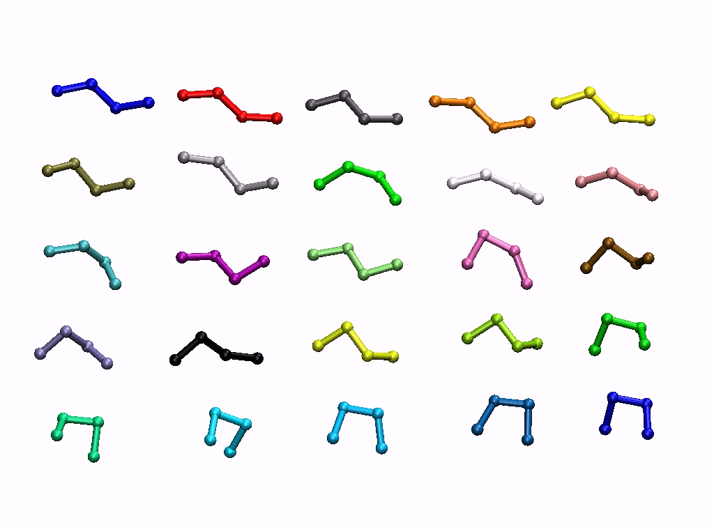

Recent Publications and Allostery Project
=========================================================
author: Jens Kleinjung
date: 03.10.2017
width: 1920
height: 1080
font-family: 'Helvetica'
navigation: slide
transition: none
#autosize: true

1. Blastocyst
========================================================
incremental: true

<small>
```
Genome editing reveals a role for OCT4 in human embryogenesis.
Fogarty, ..., Niakan (Sep. 2017) Nature.
```
</small>
***


========================================================


***
<small>
```
An engineered photoswitchable mammalian pyruvate kinase.
Gehrig, ..., Anastasiou et al.(2017) The FEBS Journal.
```
</small>


========================================================
incremental: true

***


Chimera with Light-oxygen-voltage-sensing Domain
========================================================
incremental: true

***


Light-modulated Enzymatic Activity
========================================================
incremental: true

***


3. Fragments: The M32K25 Structural Alphabet
========================================================


Symbolic Abstraction
========================================================

***


Attractors in Conformational Space
========================================================
left: 70%


***
* Clearly defined attractors
* Local energy minima
* Protein structure is assembly of local energy minima
* Structural sequences as new abstraction layer


Canonical Fragments
========================================================

***
* 25 canonical C$_4^{\alpha}$ fragments
* Fit quality: 0.70-1.00 Å RMSD for global fit (superimposed ends)
* Encoding of dynamics: Correlation >0.7 between RMSF and H$_{Shannon}$(M32K25)

<small>
```
Structural alphabets derived from attractors in conformational space.
Pandini, Kleinjung et al., BMC Bioinformatics 11 (2010) 97.
```
</small>


Fragment Fit
========================================================

***

$$ RMSF = \sqrt{\langle r^2 \rangle - \langle r \rangle ^2} $$
***
```
...WUWVURPNMUVWVVUUUW...
...UUUVXTOTSUWUUUVWVW...
...VUTVXRJUQXVUUVWTWV...
...VWUVXTFQQUWXUUVUUU...
...XXTUWSOTRUWVUUVWUU...
...XXTWXROUSUUUUUUUWU...
```

$$ H_{Shannon} = - \sum p_i \; log \; p_i $$


4. Analysis of Allosteric Signal Transmission
========================================================

***
<small>
```
GSATools: analysis of allosteric communication and functional local motions in GROMACS using a Structural Alphabet.
Pandini et al., Bioinformatics 29 (2013) 2053–2055.
```
</small>


Allostery in NtrC
========================================================


PKM2 Long-range Couplings
========================================================


<small>
```
See also:
An engineered photoswitchable mammalian pyruvate kinase.
Gehrig et al., FEBS J. (2017) 14175.
```
</small>


Next
========================================================

<small>
```
[By Opabinia regalis - Own work, CC BY-SA 3.0](https://commons.wikimedia.org/w/index.php?curid=38540293)
```
</small>

