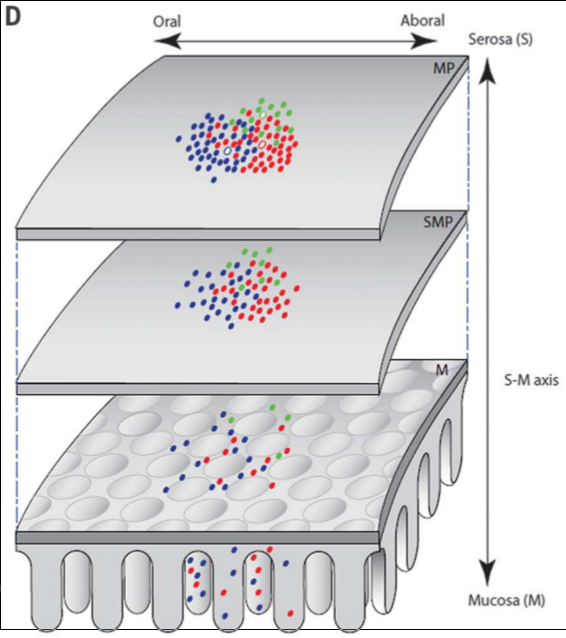
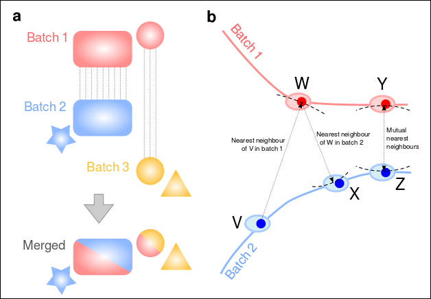

Group Meeting
========================================================
author: Jens Kleinjung
date: 27.07.2017
autosize: true


Overview
========================================================
1. Semi-supervised RNA-Seq analysis
2. Data Pipelines (with 'GNU make')
3. Single-cell RNA-Seq Normalisation


1. The Enteric Nervous System
========================================================


```
Lineage-dependent Spatial and Functional Organization of the Mammalian Enteric Nervous System;
Lasrado, Pachnis et al. (2017).
```

ENS at day E13
========================================================

***
(D) Model depicting the organization of small intestine ENS into
overlapping columns along the serosa-mucosa axis.
Each clone originates from a founder cell (white) that settles
in a given location within the outer gut wall (future MP)
and gives rise to progeny that either remain in the vicinity or
colonize in a stepwise manner the SMP and mucosa.
Sister cells are in register along the serosa-mucosa axis.


ggplot2
========================================================
(Taken from the ggplot2 wbesite and Wikipedia)

ggplot2 is a plotting system for R,
which tries to take the good parts of base and lattice graphics
and none of the bad parts.

Created by Hadley Wickham in 2005, ggplot2 is an implementation of
Leland Wilkinson's Grammar of Graphics—a general scheme for data visualization
which breaks up graphs into semantic components such as scales and layers.

The 'R Graphics Cookbook' by Winston Chang provides a set of recipes
to solve common graphics problems.
***

```r
install.packages("ggplot2")
```


Biplot
========================================================

***

```r
library(devtools)
install_github("vqv/ggbiplot")
library(ggbiplot);

g = qplot(df.u$xvar, df.u$yvar, colour = expr.gradient, size = expr.mean, xlab = u.axis.labs[1], ylab = u.axis.labs[2]);

g = g + scale_colour_gradient(low = "blue", high = "orange"); 

g = g + scale_size(range = c(1, 7));

g = g + geom_segment(data = df.v[gene.glial.nidx, ], aes(x = 0, y = 0, xend = xvar, yend = yvar, size = 1), ...
```


Heatmap
========================================================

***

```r
install.packages(“gplots”)
library(gplots)

mat.dist = function(x) {
  as.dist((1 - cor(t(x))) / 2,
  diag = FALSE, upper = FALSE)};

heatmap.2(clu_rnd.mat,
  distfun = mat.dist,
  hclustfun = function(x) hclust(x, method = "complete"),
  trace = "none", key = FALSE, scale = "row", margins = c(4, 6),
  col = my_palette, labCol = c(""), ColSideColors = cell.col);
```


Gene Bars
========================================================
right: 70%

***

```r
pValCutoff = -log10(5e-2 / dim(Yhet)[2]);

Yh.G.1 = Yhet[ , glialID1];
Yh.N.1 = Yhet[ , neuronalID1];

lmAll <- t(apply(Yhet , 
      !colnames(Yhet) %in% marker.ids], 2, function (v) {
    myLm <- lm(v ~ Yh.G.1 + Yh.N.1);
    myAnova <- anova(myLm);
    coeffs <- myLm$coeff[-1]; 
    pVals <- -log10(myAnova[["Pr(>F)"]][-(length(coeffs) + 1)]);
    return (c(coeffs, pVals));
}))
```


```r
g = ggplot(gene_corr, aes(x = rank, y = nlogpvalnum)) +
  geom_bar(stat = "identity", fill = colour, width = 0.75);
g = g + coord_flip(xlim = c(1, 35), ylim = c(pValCutoff, 22));
g = g + scale_x_discrete(limits = 
          as.vector(unlist(gene_corr$geneName)));
```


3D Profile
========================================================

***

```r
x = glial.marker.exp.mean;
y = neuronal.marker.exp.mean;
den3d.cell = kde2d(x, y);
```


```r
persp(den3d.cell, box = TRUE, theta = -120, 
  col = rgb(red = col.mat,
        green = (0.65 * col.mat),
        blue = (1 - col.mat), alpha = alpha.mat),
  ...);
```


2. RNA-Seq Alignment Pipeline
========================================================
- Dependency resolution: sample_x.fastq.gz <- fastq <- bam <- counts <- table <- normalised table
- GNU Make
    * Macros
    * Rules with dependencies + external programs
    * Pattern rules


Pipeline Structure
========================================================
```
-root/Makefile
 +- PROGRAM/Makefile
  -       ./<aligner>
 +- OME/Makefile
  -   ./<genome>
  -   /<transcriptome>
 +- INPUT/Makefile
  -     ./<experiment>/<sample1>/<sequence>_R1.fastq
  -                  ./<sample2>/<sequence>_R1.fastq
 +- OUTPUT/Makefile
  -      ./<experiment>/<sample1>/<sequence>.counts
  -                   ./<sample2>/<sequence>.counts
 +- MERGE/Makefile
        ./genali.merge
 +- ASSEMBLE/Makefile
  -        ./genali.assemble
 +- QUALITY/Makefile
  -       ./genali.quality
 +- NORMALISE/Makefile
  -         ./genali.normalise
```

Master Makefile
========================================================

```make
-include config.mk

SMP = $(notdir $(shell find ./INPUT/${EXP}/ -type d -name ${SAMPLEPREFIX}))

all : align postalign proc 
align : config exp program ome samplein input output
postalign : exp sampleout count
proc : log merge quality normalise pca 

program :
    cd PROGRAM || exit 1 ; ${MAKE} all "PARALLEL=${PARALLEL}" "GUNZIP=${GUNZIP}"
      "ALI=${ALI}" "RSCRIPT=${RSCRIPT}" "FEATURECOUNTS=${FEATURECOUNTS}"

output :
    cd OUTPUT || exit 1 ; ${MAKE} all "EXP=${EXP}" "SMP=${SMP}"
      "SAMPLEPREFIX=${SAMPLEPREFIX}" "GENALIHOME=${GENALIHOME}"
      "CLU=${CLU}" "QUEUE=${QUEUE}" "ALI=${ALI}" "ALIMODE=${ALIMODE}"
      "ALIOPT=${ALIOPT}" "OME=${OME}" "SINGLE=${SINGLE}"
      "SLEEP=${SLEEP}" "NCPU=${NCPU}""
```


OUTPUT Makefile with Dependency
========================================================

```make
SMPOUT = $(notdir $(shell find ./${EXP}/ -type d -name ${SAMPLEPREFIX}))

all : sampledir link mkalign

ifeq ($(strip ${ALI}),tophat2)
    for X in ${SMP} ; do \
        ${MAKE} align_tophat2 "EXP=${EXP}" "X=$$X" \
                         "GENALIHOME=${GENALIHOME}" \
                         "CLU=${CLU}" "QUEUE=${QUEUE}" \
                         "ALI=${ALI}" "ALIMODE=${ALIMODE}" "ALIOPT=${ALIOPT}" \
                         "OME=${OME}" "SINGLE=${SINGLE}" \
                         "SLEEP=${SLEEP}" "NCPU=${NCPU}" ; \
    done
    srun --dependency=singleton --job-name=GIfa.${EXPNR} singleton.bash
endif

align_tophat2 : ${EXP}/$X/accepted_hits.bam
```


Pattern Rules
========================================================
```
%/accepted_hits.bam : %/genali_R1.fastq
$(info running in single-end mode)

srun --job-name=GIfa.${EXPNR} ${QUEUE}
  -o ${EXP}/$X/genali.o -e ${EXP}/$X/genali.e
  ${GENALIHOME}/PROGRAM/${ALI} ${ALIOPT}
  -p ${NCPU} -o ${EXP}/$X
  ../OME/$(strip ${OME})/Sequence/Bowtie2Index/genome $^
    > ${EXP}/$X/aligner.o 2> ${EXP}/$X/aligner.e &

sleep ${SLEEP}
```


scRNA-Seq Normalisation: Global Factor
========================================================

***
* Plotted is the log expression of 8 genes or gene groups (biological factors) in 6 single cells
* The difference between the expression of individual cells is a constant factor.
* A simple linear model of the log-expression normalises the data set:
```
v = (1, 1.1, 1.2, 1.7, 1.6, 1.5);
```
* The 'global factor' model is naive and unrealistic, because the data structure is not so simple.


More Complicated: + Differential Gene Expression
========================================================

***
* Here we have a highly differentially expressed gene in cell group (4,5,6).
* How do we normalise now?

1. Either we ignore differentially expressed genes
2. or we compute normalisation factors for quantiles.


Even More Complicated: + Zero Inflation
========================================================

***
* Zero inflation means that many genes are not detected, although they should be detectable.
* The expression values ==0 distort averaging, which is used in some RNA-Seq software like DESeq.
* Additionally, methods that rely on multi-variate expression vectors are compromised.


Even More Complicated: + Dependency on Count-Depth
========================================================

***
* Sequencing depth influences the relative gene expression values.
* The SCnorm package addresses this problem by performing a controlled quantile regression.

```
SCnorm: robust normalization of single-cell RNA-seq data;
Bacher, Kendziorski et al. (2017).
```


scran
========================================================

***
* Compute batch vector between pairs of mutual nearest neighbour cells.
* Calculate cell-specific batch correction vector from weighted average over all pairwise vectors, using a Gaussian kernel.

```
Correcting batch effects in single-cell RNA sequencing data by matching mutual nearest neighbours;
Haghverdi, Marioni et al. (2017).
```


zinb-wave
========================================================


```
ZINB-WaVE: A general and flexible method for signal extraction from single-cell RNA-seq data;
Risso, Vert et al. (2017).
```
